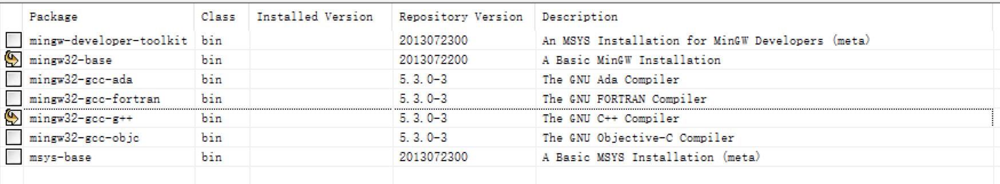
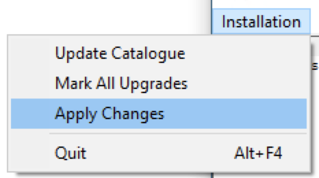
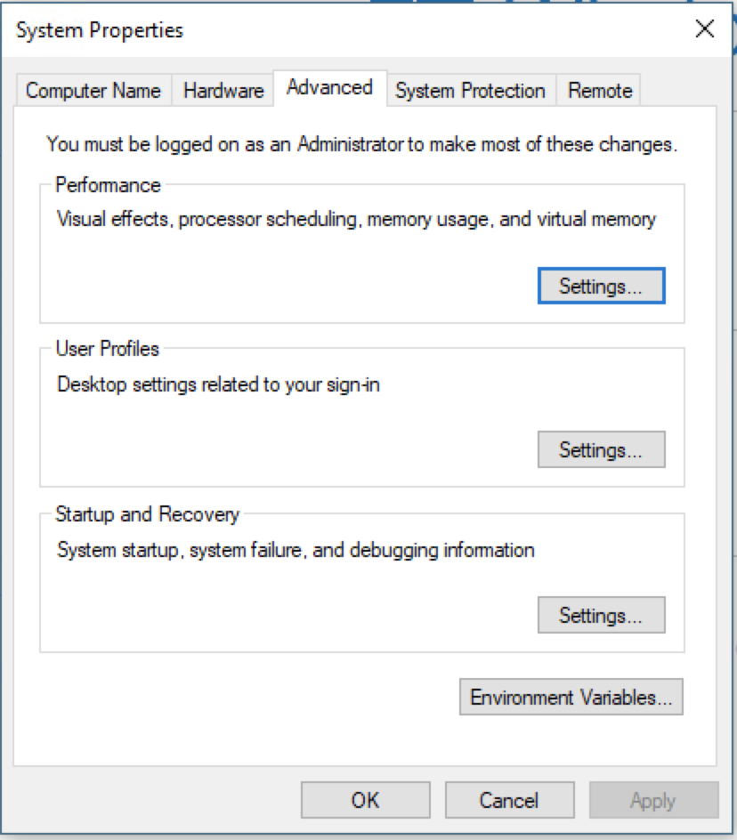
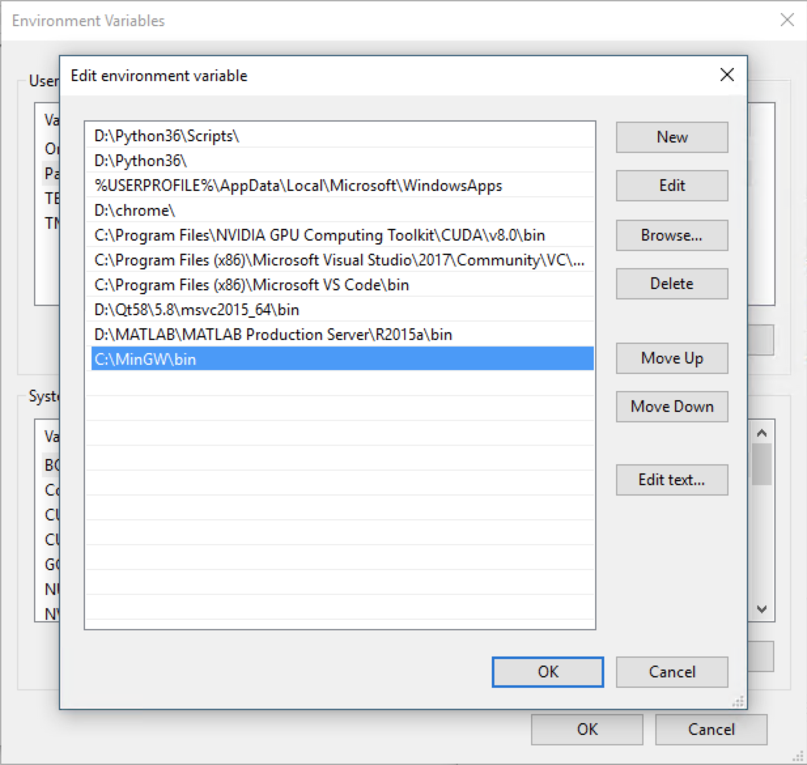
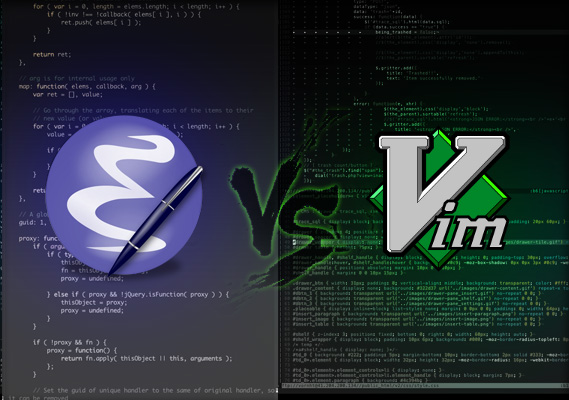
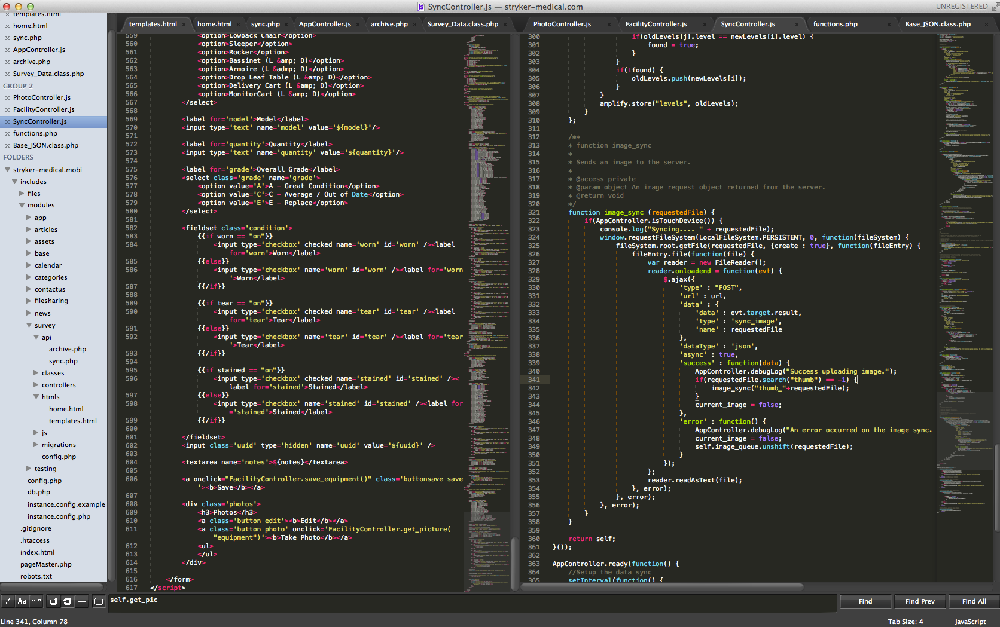
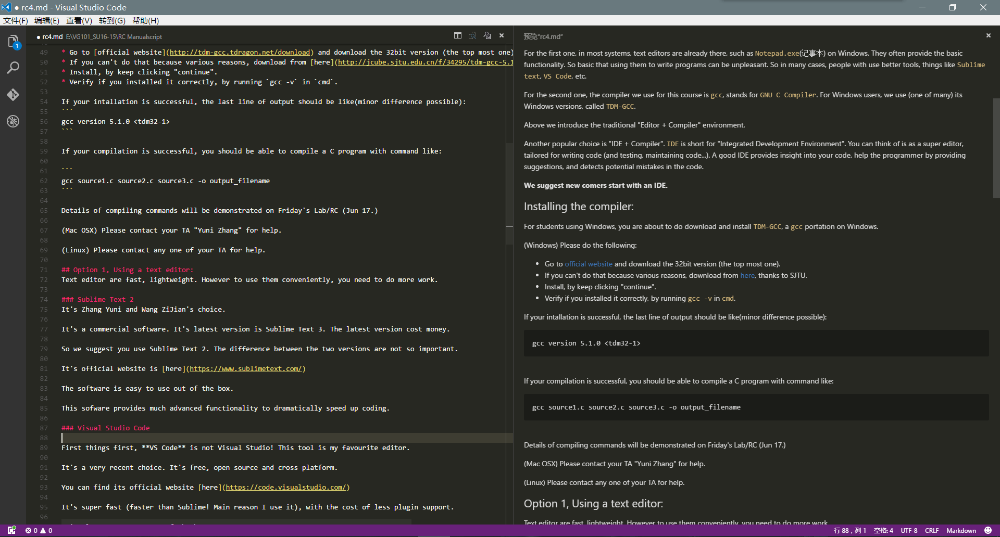
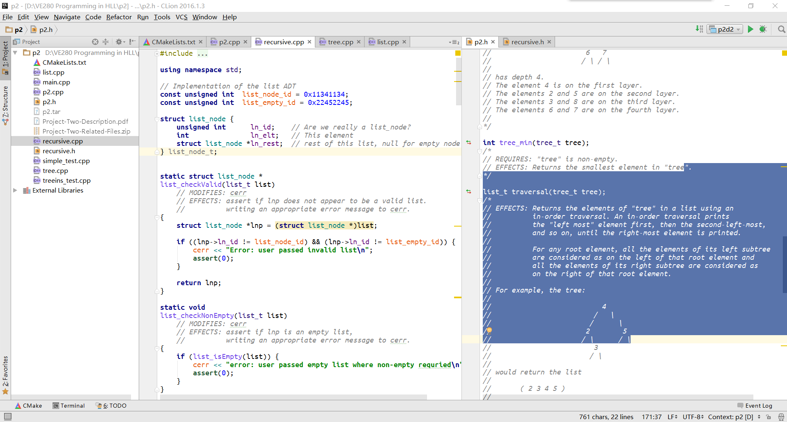
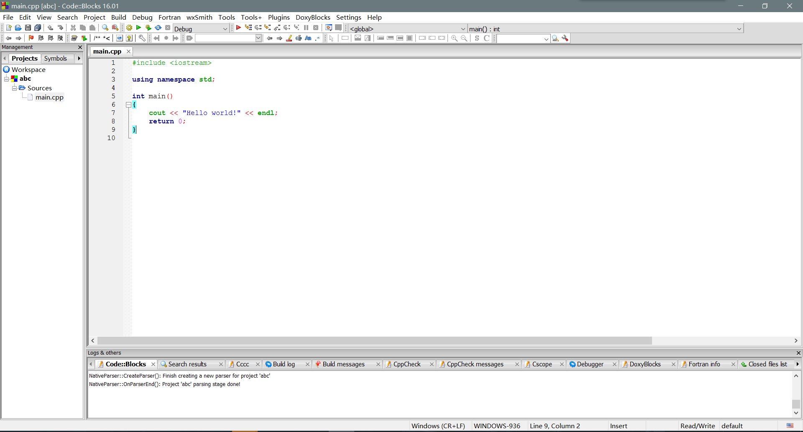

# C/C++ Environment Setup Guide

NOTE: This guide is basically for Windows and MacOSX user. For linux user, we believe you can handle it yourself. :)

## Background Knowledge

Skip the part if you are not interested. 
But these knowledge are essential if you want to understand what you are doing.

Unlike Matlab, C/C++ are compiled language. Meaning their code (code is text) need to be translated (compiled)
into executable files (binary files, just series meaningless numbers, at least meaningless for most human).

C/C++ are compiled languages. Meaning, the general way of writing and executing a C program, is

1. Write a C program in a text file (or a collection of files), call this file a "source" file.
2. Use a special program (namely "the compiler") to translate the into a binary file, this step is "compile".
3. Run this binary file to see results.

You are expected to know these three steps. 

So basically, to set up the C environment is to the following 2 things:

1. You need a text editor to edit text file. 
2. You need a compiler so when you are done editing, use it to compile the file.

So you just pick one editor from a bunch of choices, then install the compiler. Then you are good.

For the first one, in most systems, text editors are already there, such as `Notepad.exe`(记事本) on Windows. In many cases, people with use better tools, things like `Sublime text`, `VS Code`, etc.

For the second one, the compiler we use for this course is `gcc`, stands for `GNU C Compiler`. For Windows 
users, we use (one of many) its Windows versions, called `TDM-GCC`.

Above we introduce the traditional **"Editor + Compiler"** environment.

Another popular and common choice is **"IDE + Compiler"**. `IDE` is short for "Integrated Development Environment".
 You can think of is as a super editor, tailored for writing code (and testing, maintaining code...).
 A good IDE provides insight into your code, help the programmer by providing suggestions,
and detects potential mistakes in the code. 

**We suggest new comers start with an IDE.**

## Install the Compiler:

### Windows

Windows does not contain C/CPP compiler itself, so for students using Windows, you are about to do download and install them by yourselves. There are a few choice available for this course
- TDM-GCC (mostly recommended)
- MinGW
- WSL:Windows Subsystem for Linux (advanced)
- Cygwin (strongly against)

Here we will only talk about the first two choices in detail. If you have interest for the latter two, you can have a try on your own. :)

#### TDM-GCC

TDM-GCC is based on mingw, however it is better maintained. To install TDM-GCC on your computer, do as following

* Go to [official website](http://tdm-gcc.tdragon.net/download) and download the 32bit version (the top most one) **no matter your system is 32-bit or 64-puter**
* If you can't do that because of various reasons, download from [here](http://jcube.sjtu.edu.cn/f/34295/tdm-gcc-5.1.0-3.exe), thanks to SJTU.
* Install, by keep clicking "continue".
* Verify if you installed it correctly, by running `gcc -v` in `cmd`.

If your installation is successful, the last line of output should be like(minor difference possible):
```
gcc version 5.1.0 <tdm32-1>

```

#### MinGW

MinGW is a traditional choice. To install it, take the following steps:
* Visit [MinGW](http://www.mingw.org/).
* Download installer.
* Run the installer and follow the instruction to install MinGW 
* Mark mingw32-base and mingw32-gcc-g++.

* Apply change in Installation in menu bar.

* Open Windows Settings->System->About->System info->Advanced system settings

* Click Environment Variables->Double click Path->Add the directory /bin in MinGW installation path to the path

* restart computer.
* run ```gcc -v``` in cmd. If it shows information about gcc, then the installation is succeeded.

***
If your compilation is successful, you should be able to compile a C program with command like:

``` 
gcc source1.c source2.c source3.c -o output_filename
```

Details of compiling commands will be demonstrated on in latter RC and documents. If you have no patience to wait, we also encourage you to read the detailed documentation on GNU or by ```man gcc```.

**You can include the compile command in your README. Do this especially if your code require some special compile commands**

Extra note: for students who know about "C Standards" (no worry if you don't), this course allow use features from 2011 standard and ealier. 

### MacOSX

Things are a little bit easier on Mac. :)

* Open terminal, and run ```xcode-select --install``` (If you have no idea about what terminal is or how to open it, it's time to learn or switch to use Windows.:-))
* run ```gcc -v``` in cmd. If it shows information about gcc, then the installation is succeeded.

## Text Editors or IDEs, that's still a question

Firstly we introduce you some famous text editors and IDEs to give you some rough idea on which to choose. We will discuss their pros and cons later.

### Text Editors
Text editors are fast, lightweight. However to use them conveniently and efficiently, more works are required to done on your own. :)

Here we show some famous and common text editors

#### Vim and Emacs



There's an old saying with regards to them: 

>Vim is God of text editor, while Emacs is God's text editor. 

We won't talk about the controversive topic on which one is better here, one thing can be concluded is that both are for advanced users, in other words, both need pretty much extra time for you to get familiar with and start to use it. Think it over before you made your decision.

#### Sublime Text 2


It used to be a lot of people's first choice a few years ago, but it seems that this trend is cooling down. 

It's a commercial software. It's latest version is Sublime Text 3. The latest version cost money. So we suggest you use Sublime Text 2. The difference between the two versions are not so important. But if you are very rich and don't care about that license's price, you could still choose Sublime Text 3.

Its official website is [here](https://www.sublimetext.com/)

The software is easy to use out of the box. One big feature of it is its great community which has developed numerous plugins that could help you speed up coding.

#### Visual Studio Code


First things first, **VS Code** is not Visual Studio!
 
It's a very recent choice. It's free, open source and cross platform. Also, it's coming more and more popular.

You can find its official website [here](https://code.visualstudio.com/)

It's super fast (faster than Sublime!), with the cost of relatively less plugin support. However this weakness is weakened since more and more advanced developers move to use it in recent years.

We will offer a brief documentation on how to use VSCode efficiently for VG101 as well.

### IDEs

Due to various reasons, in our section **Microsoft Visual Studio is strictly PROHIBITED**

**DO NOT USE MS VISUAL STUDIO**

IDEs are heavy weight. They are easy to use out-of the box. However the cost is they are much slower.

#### Clion


It's my personal favourite. It's a commercial software from a company called JetBrains.
 Students with SJTU email-address can apply for a free license easily. To get a student license, please visit [JetBrains Student](https://www.jetbrains.com/student/)

It is arguably __the most powerful__ IDE at this time. Unlike many other IDEs, it actually tries to understand your code, other then seeing them as texts. 

Here is its [Official Website](https://www.jetbrains.com/clion/). 
After installing the software you will need tell it where your "gcc" is.
You will need to register for your JetBrains Account also on the official website for the free license.

Note that this IDE also works for Linux and Mac. (From my point of view, not as good as it is on Windows.)

After you have installed it, you need to tell it where your `gcc` is installed. Once you tell it the location, the software will take care of the rest. **Do not use path with Chinese characters** when you set up your location of your program directory. 

A concrete and detailed documentation will be offered soon.

#### Code::Blocks


It is an open-source, cross-platform IDE. Meaning it works on "Windows, Linux, MacOSX".

It was the choice of this course years ago. But now we recommend you to use Clion instead unless you have **very limited disk space**.

It's official download page is [here](http://www.codeblocks.org/downloads/26). 

#### XCode

A powerful but heavy IDE for MacOSX. Not recommended.

***
Now we have introduced two options for you. Here is some main difference between them:

* IDEs tends to be slower.
* IDEs are larger in size.
* IDEs requires some time to get familiar
* IDEs offer better functionality out of the box
* Meaning it can cut the amount of memorization, good for starters
* Meaning it can cut mistakes! Another reason good for starters.
* Text editors are fast.
* Text editors are smaller.
* Text editors provides basic functions.
* Text editors require more user work be become handy.
* Text editors are free. More flexibility to change.

The argue of whether text editors are better then IDE has always been there, since the first IDE existed. Some may argue "good programmers" always use text editors. 

__This is simply not true__.

Programmers choose the most suitable tool for their job. The baseline is, good programmers 
always write good programs, no matter what tool they use.

**For starters, we really suggest you start by using Clion.** Clion really understands your code and we believe you will soon find the great benefit Clion give to you.
